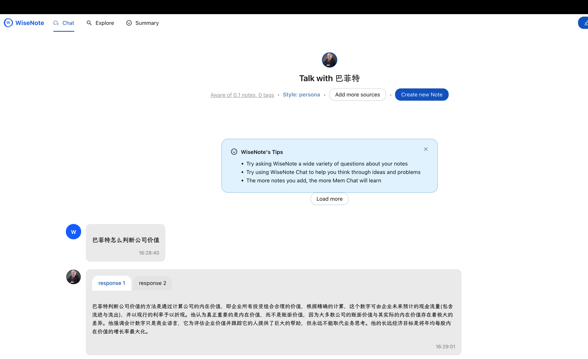
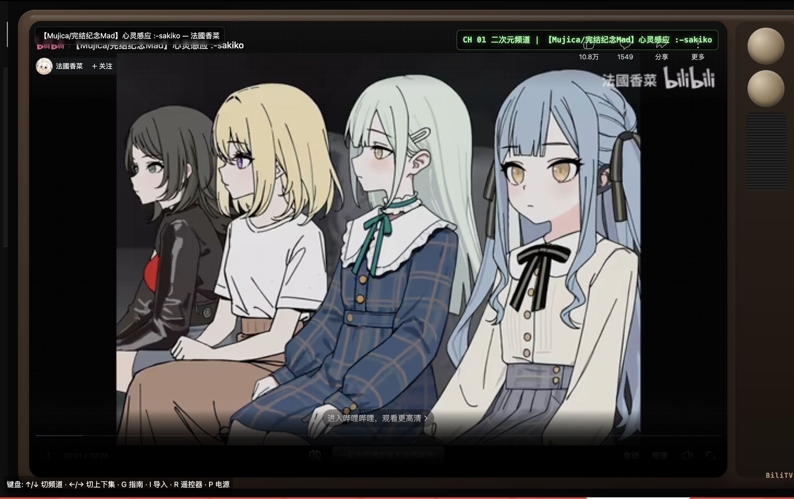
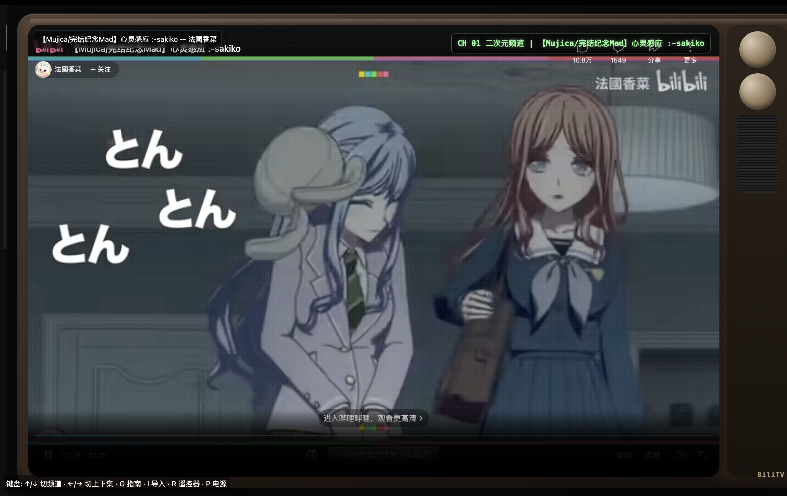

# BiliTV

> A retro-TV styled, channel-surf Bilibili web player.  
> 一个“像看电视一样换台”的 Bilibili 复古电视风播放器。

## Features / 功能亮点

- Retro TV shell UI, OSD, scanline/noise, power on/off effects  
  复古电视外壳、频道 OSD、扫描线/噪点、开关机动画
- Channel surfing with random next channel/video behavior  
  频道冲浪体验，随机切台/随机下一条
- TV-style playback feel (mouseless mode, masked controls, zap effect)  
  电视化交互（无鼠标模式、控件遮罩、换台噪声插播）
- Import BVID list as channels  
  支持粘贴 BV 列表导入频道
- Remote control page + keyboard control  
  远程控制页 + 键盘控制

## Quick Start / 快速开始

```bash
npm install
npm start
```

Open / 打开: `http://localhost:3000`

## Controls / 操作说明

- `↑ / ↓`: switch channel / 切换频道
- `← / →`: previous/next item / 上下条
- `T`: TV fullscreen mode / 电视全屏模式
- `M`: mouseless mode / 无鼠标模式
- `R`: open remote modal / 打开遥控器弹窗
- `P`: power on/off / 电源开关
- `G`: toggle guide / 显示或隐藏频道列表
- `I`: import panel / 打开导入面板

## Project Structure / 项目结构

- `server/`: Express API (channels/import/metadata/SSE)
- `web/`: frontend UI and TV UX
- `data/channels.json`: channel data store (MVP file-based)
- `images/`: runtime screenshots

## Notes / 说明

- MVP currently uses the official Bilibili iframe player.
- File-based storage is used for fast iteration; can migrate to DB later.
- Some player controls are hidden by UI masking for TV immersion.
- 本项目当前为 MVP，优先可用与体验；后续可扩展数据库与更完整播放控制。

## Screenshots / 运行截图





